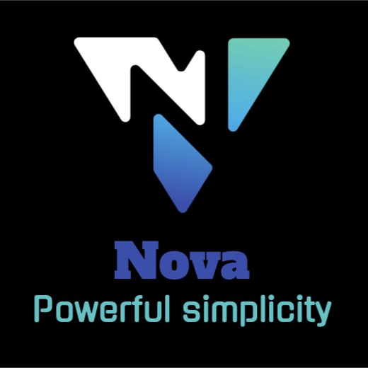

<center>
    <h1 align="center">Welcome to Nova 👋</h1>
    <p>
    <a href="">
        
    </a>
    <a href="">
        
    </a>
    <a href="LICENSE.md" target="_blank">
        
    </a>
    <a href="package.json" target="_blank">
        
    </a>
    <a href="https://www.codacy.com?utm_source=github.com&amp;utm_medium=referral&amp;utm_content=dan-online/Nova&amp;utm_campaign=Badge_Grade"></a>
    </p>

    > Computer science simplified for learning purposes.

    ## Install

    ```sh
    npm install
    ```

    ## Usage

    ```sh
    nova test.ns
    ```

    ## Run tests

    ```sh
    npm test
    ```

    ## Author

    👤 **DanCodes <dan@dancodes.online>**

    - Website: https://dancodes.online
    - Github: [@dan-online](https://github.com/dan-online)

    ## 🤝 Contributing

    Contributions, issues and feature requests are welcome!<br />Feel free to check [issues page](https://github.com/dan-online/Nova/issues).

    ## Show your support

    Give a ⭐️ if this project helped you!

    <a href="https://www.patreon.com/mayorchano">
    
    </a>

    ## 📝 License

    Copyright © 2020 [DanCodes <dan@dancodes.online>](https://github.com/dan-online).<br />
    This project is [MIT](LICENSE.md) licensed.

    ---

    _This README was generated with ❤️ by [readme-md-generator](https://github.com/kefranabg/readme-md-generator)_

</center>
